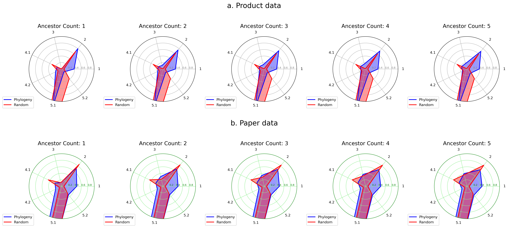
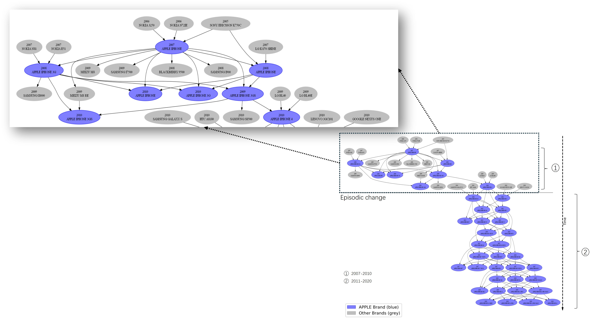

# Evolutionary Insights into Technology: A Novel Distance-Based Phylogenetic Approach  
## Abstract
Technological evolution, much like biological evolution, is marked by continuous innovation and adaptation, reshaping society and influencing economic systems. This study introduces a novel distance-based method for constructing technological phylogenies, addressing the limitations of traditional phylogenetic models. Unlike gene-based approaches, this model measures technological distances to better capture complex dynamics such as horizontal knowledge transfer and path dependency. Validated with empirical data from mobile products and AI research, this approach demonstrates flexibility and precision in mapping evolutionary paths. By providing mathematical formulas for phylogeny construction, this method offers a robust framework to analyze technological trends and identify pivotal innovations, advancing our understanding of technological evolution.
## Keywords  
Technological Phylogeny, Phylogenetic Network, Innovation Evolution, Distance-based Phylogeny, Horizontal Knowledge Transfer  
## Repository structure  
  data/ # Contains all data files  
  code/ # Contains all code files  
  Figures/ # Contains figures in the paper  
  README.md # Project description file
## Framework    
  

## Validation results
 

## Apple product phylogenetic network  
  

## AI-related paper field phylogenetic network  
   

Other content including codes will be uploaded later.  
## Contact  
heyouwei2022@gmail.com  
